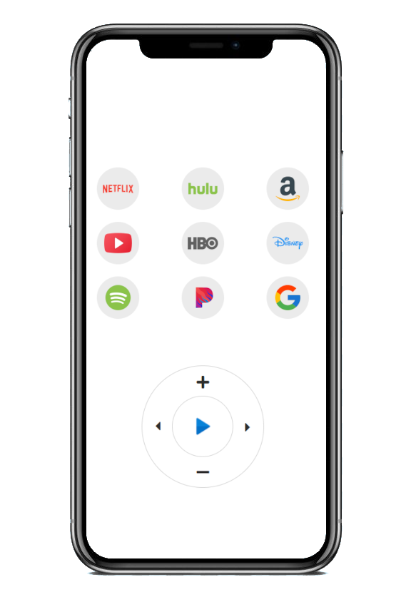

# TV Remote
A python/flask web server that can perform basic functions to optimize your lazyness.
With one tap of a button, open a streaming service from your phone, control the volume, pause and play, and skip.
[Video demo on YT](https://www.youtube.com/watch?v=o4WpVH0GWw0)



## Running for yourself
Make sure that the IP address in main.py `app.run()` is the same as the machine you are planning on running the webserver on.
Install the dependancies:
```
pip install flask pyautogui
```
Run:
```
python main.py
```

connect the the ip address of the computer running the server from your phone
For example, `192.168.1.10:7070`

<br>
Tested on
* YouTube
* Amazon Prime Video
* Disney+
